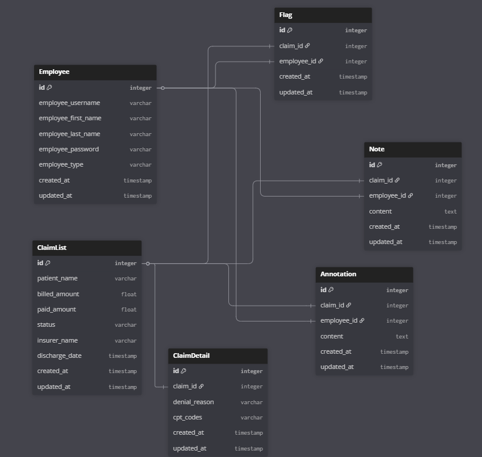
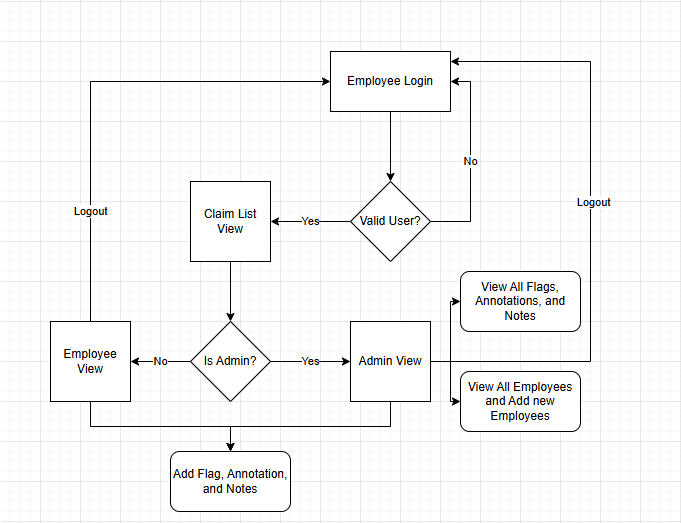

# Project Tech Stack

## Frontend
  * HTML/CSS
  * Frameworks: HTMX & Alpine.js
  * CSS Style: TailwindCSS
## Backend
  * Django v4+/Python v3.9+
## Database
  * SQLite

# Installation
  * Must have Python Version: 3.9.13+
  * Must Have Node.js Version: 18+ or 20.x.x
  * Code Editor: VSCode
  ## If using Git Repo
   
   1. Open VSCode
   2. Create a new project folder
   3. Go to the GitHub Repository
   4. Click on code
   5. Copy the http URL (<repoURL>.git)
   6. Paste it into the command line (CMD)
  ## If Downloading the .ZIP File
   1. Go to the GitHub Repository
   2. Click on code
   3. Click on "download .ZIP"
   4. Extract contents
   5. Open the directory in VSCode
  ## Installing Required Libraries
  1. ls (Show which directories are accessible)
  2. cd into working directory ```cd ERISA-Recovery-Dev-Challenge-2025-main``` (Or the directory before you access ./backend/ or ./frontend/)
  3. Create Python env ```python -m venv env```
  4. Start Python env   
  ```
  env\Scripts\activate
  ```
  * If asked which interpreter to use
    1. Do 'Ctrl+Shift+P' on Windows or 'Cmd+Shift+P' on Mac
    2. Type ```Python: Select Interpreter```
    3. Choose the env that was created or set up a new env using Python 3.9.13+
  * Must be in the Python env
  5. Cd into the backend folder ```./backend/```
  ```
  pip install -r requirements.txt
  ```
  6. Go back to the previous directory, then cd into the frontend folder ```./frontend/```
  ```
  npm install
  ```
  # Starting Application
  * Must be in the Python env
  1. cd ./backend/
  * -> search for changes ```python manage.py makemigrations```
  * -> applies changes```python manage.py migrate```
  * -> runs django server```python manage.py runserver```
  * -> Open brower ```127.0.0.1:8000```

  # If Editing CSS
  1. Open a new PowerShell
  2. cd '/frontend/
  * Command starts tailwindcss and watches for any CSS changes and applies them to the HTML
  * -> ```npx tailwindcss -i .\css\tailwind.css -o .\static\css\output.css --watch --verbose```

  ## Using Base Command
  ### "load_data"
  1. Command will only work with .json or .csv extensions
  * Must be in ./backend/ folder
  * -> 'help' command to view details of the command ```python manage.py help load_data```
  * -> executes command ```python manage.py load_data <path_to_data> --model=<ClaimList|ClaimDetail> --app=core```
    - Command will only use ClaimList OR ClaimDetail, not both
  # Superuser & Login Infomation
  ## If Data is Not Cleared
   * Existing Superuser (if data is not cleared)
```
      Superuser for SQLite
       - Username: admin
       - Password: DevAdmin12
```
   * Existing Employees (if data is not cleared)

```
      Admin
      - Username: Leo13
      - Password: Admin
      Employee
      - Username: Ash
      - Password: Test1
```
  
   ## Create Superuser
   * -> ```python manage.py createsuperuser```
   * Enter desired ```<Username>```
   * Email is optional
   * Password (Django has a strength requirement)
   * -> Execute ```python manage.py runserver```
   * -> Open brower ```127.0.0.1:8000/admin/```
# Database Schema

# Website Flowchart


# Core Requirements

 * Data Ingestion
 * Claims List View
 * HTMX Detail View
 * Flag & Annotate
 * Search & Filter

# Additional Requirements

 * Admin Dashboard
 * CSV Re-Upload
 * User Authentication

# File Structure
```
  - Root Directory
        - backend
             - core
                - management
                - admin.py
                - models.py
                - urls.py
                - views.py
             - manage.py
        - frontend
            - css
            - icons
            - node_modules
            - static
            - templates
                 - admin_page
                       - annotation_function
                             - <components>.html
                       - dashboard
                             - <components>.html
                       - employee_function
                             - <components>.html
                       - flag_function
                             - <components>.html
                       - note_function
                             - <components>.html
                 - base_components
                       - <components>.html
                 - claim_list_page
                       - <components>.html
                 - login_page
                       - <components>.html
                 - register_page
                       - <components>.html
                 - base.html
        - data
           - <file_name>.json
           - <file_name>.csv
```
